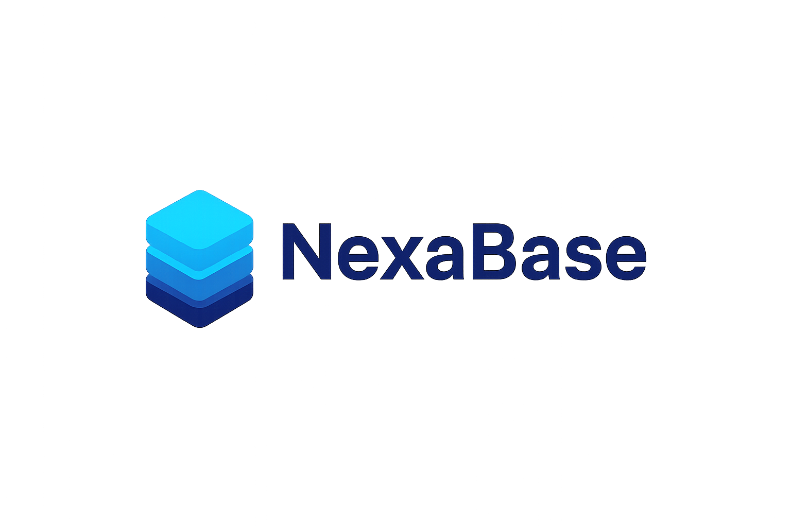
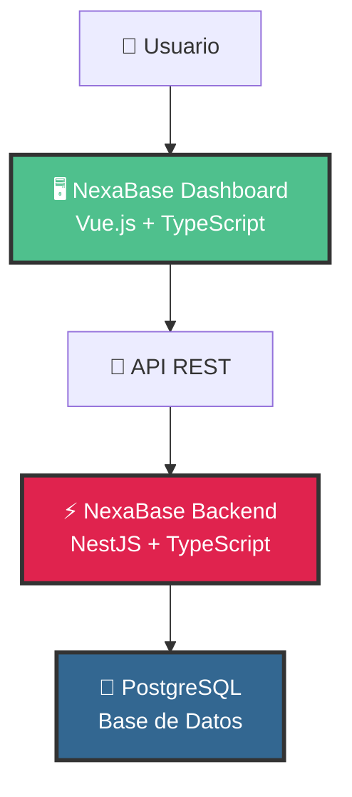

# 🚀 NexaBase Dashboard

<div align="center">



**El Frontend Elegante para tu Backend-as-a-Service**

[](https://vuejs.org/)
[](https://www.typescriptlang.org/)
[](https://vitejs.dev/)
[](https://tailwindcss.com/)

*Una interfaz moderna y profesional para gestionar tu plataforma BaaS con elegancia y eficiencia*

</div>

---

## 🌟 ¿Qué es NexaBase Dashboard?

**NexaBase Dashboard** es la interfaz de administración frontend para **NexaBase**, nuestro potente Backend-as-a-Service (BaaS). Diseñado con Vue.js 3 y TypeScript, proporciona una experiencia de usuario excepcional para gestionar bases de datos, colecciones, usuarios y toda la infraestructura de tu aplicación desde una interfaz web intuitiva y moderna.

### 🎯 Nuestra Misión

Transformar la complejidad del backend en simplicidad visual. NexaBase Dashboard te permite:

- **Gestionar Collections** con esquemas dinámicos
- **Administrar Usuarios** y roles de forma intuitiva  
- **Visualizar Datos** en tiempo real con tablas interactivas
- **Configurar Reglas de Autorización** con clicks, no código
- **Monitorear el Sistema** con estadísticas en vivo

---

## 🏗️ Arquitectura del Ecosistema



### 🔧 Stack Tecnológico

| Componente        | Tecnología                 | Propósito                       |
| ----------------- | -------------------------- | ------------------------------- |
| **Frontend**      | Vue.js 3 + Composition API | Interfaz reactiva y moderna     |
| **Tipado**        | TypeScript                 | Desarrollo seguro y escalable   |
| **Build Tool**    | Vite                       | Desarrollo rápido y HMR         |
| **Estilos**       | Tailwind CSS               | Diseño responsive y consistente |
| **Routing**       | Vue Router                 | Navegación SPA                  |
| **Estado**        | Pinia                      | Gestión de estado global        |
| **Backend**       | NestJS + TypeScript        | API REST robusta y escalable    |
| **Base de Datos** | PostgreSQL                 | Almacenamiento confiable        |

---

## ✨ Características Principales

### 🎨 **Interfaz Moderna**
- Diseño limpio y profesional con Tailwind CSS
- Modo responsive para desktop, tablet y móvil
- Componentes reutilizables y consistentes
- Animaciones suaves y transiciones elegantes

### 📊 **Gestión de Collections**
- Creación de esquemas dinámicos con validaciones
- Editor visual de campos con tipos de datos
- Configuración de índices y relaciones
- Vista previa en tiempo real de los cambios

### 👥 **Administración de Usuarios**
- Panel de control de usuarios registrados
- Gestión de roles y permisos
- Estadísticas de actividad y uso
- Herramientas de moderación integradas

### 🔐 **Sistema de Autorización**
- Configuración visual de reglas CRUD
- Roles personalizables (public, authenticated, owner, admin)
- Preview de permisos en tiempo real
- Auditoría de accesos y cambios

### 📈 **Dashboard Analítico**
- Métricas en tiempo real del sistema
- Gráficos de uso y rendimiento
- Alertas y notificaciones inteligentes
- Exportación de reportes

---

## 🚀 Inicio Rápido

### Prerrequisitos

```bash
# Node.js 18+ y npm
node --version  # v18.0.0+
npm --version   # 8.0.0+
```

### Instalación

```bash
# 1. Clonar el repositorio
git clone https://github.com/tu-usuario/nexabase-dashboard.git
cd nexabase-dashboard

# 2. Instalar dependencias
npm install

# 3. Configurar variables de entorno
cp .env.example .env
# Editar .env con tu configuración

# 4. Iniciar servidor de desarrollo
npm run dev
```

### Variables de Entorno

```env
# .env
VITE_API_BASE_URL=http://localhost:3000/api
VITE_APP_NAME=NexaBase Dashboard
VITE_APP_VERSION=1.0.0
```

---

## 🛠️ Scripts Disponibles

```bash
# Desarrollo
npm run dev          # Servidor de desarrollo con HMR
npm run build        # Build de producción
npm run preview      # Preview del build de producción

# Calidad de Código
npm run type-check   # Verificación de tipos TypeScript
npm run lint         # Linting con ESLint
npm run format       # Formateo con Prettier

# Testing
npm run test         # Ejecutar tests unitarios
npm run test:e2e     # Tests end-to-end
npm run coverage     # Reporte de cobertura
```

---

## 📁 Estructura del Proyecto

```
nexabase-dashboard/
├── 📁 public/              # Archivos estáticos
│   ├── logo.png           # Logo de la aplicación
│   └── favicon.ico        # Favicon
├── 📁 src/
│   ├── 📁 assets/         # Recursos (imágenes, estilos)
│   ├── 📁 components/     # Componentes reutilizables
│   ├── 📁 layouts/        # Layouts de página
│   ├── 📁 pages/          # Páginas de la aplicación
│   │   ├── 📁 collections/    # Gestión de collections
│   │   ├── 📁 dashboard/      # Panel principal
│   │   ├── 📁 users/          # Administración de usuarios
│   │   └── LoginPage.vue      # Página de login
│   ├── 📁 services/       # Servicios y API calls
│   ├── 📁 stores/         # Stores de Pinia
│   ├── 📁 types/          # Definiciones TypeScript
│   ├── 📁 utils/          # Utilidades y helpers
│   ├── App.vue            # Componente raíz
│   └── main.ts            # Punto de entrada
├── 📄 index.html          # Template HTML
├── 📄 vite.config.ts      # Configuración de Vite
├── 📄 tailwind.config.js  # Configuración de Tailwind
├── 📄 tsconfig.json       # Configuración de TypeScript
└── 📄 package.json        # Dependencias y scripts
```

---

## 🎨 Capturas de Pantalla

### 🏠 Dashboard Principal
*Vista general con métricas y estadísticas del sistema*

### 📊 Gestión de Collections
*Editor visual para crear y modificar esquemas de datos*

### 👤 Panel de Usuarios
*Administración completa de usuarios y permisos*

### 🔐 Login Elegante
*Interfaz de autenticación moderna con diseño dividido*

---

## 🤝 Contribuir

¡Nos encanta recibir contribuciones! Por favor lee nuestra [Guía de Contribución](CONTRIBUTING.md) para conocer el proceso.

### Proceso de Desarrollo

1. **Fork** el repositorio
2. **Crea** una rama para tu feature (`git checkout -b feature/AmazingFeature`)
3. **Commit** tus cambios (`git commit -m 'Add some AmazingFeature'`)
4. **Push** a la rama (`git push origin feature/AmazingFeature`)
5. **Abre** un Pull Request

### Estándares de Código

- **TypeScript** para tipado estático
- **ESLint + Prettier** para consistencia
- **Conventional Commits** para mensajes
- **Tests unitarios** para nuevas funcionalidades

---

## 📋 Roadmap

### 🎯 Versión 1.1
- [ ] Editor de esquemas con drag & drop
- [ ] Tema oscuro/claro
- [ ] Exportación de datos en múltiples formatos
- [ ] Notificaciones push en tiempo real

### 🎯 Versión 1.2
- [ ] Dashboard personalizable con widgets
- [ ] Sistema de plugins
- [ ] API GraphQL integrada
- [ ] Modo offline con sincronización

### 🎯 Versión 2.0
- [ ] Editor visual de flujos de trabajo
- [ ] Integración con servicios externos
- [ ] Marketplace de templates
- [ ] IA para optimización automática

---

## 📞 Soporte y Comunidad

### 🆘 ¿Necesitas Ayuda?

- 📖 **Documentación**: [docs.nexabase.com](https://docs.nexabase.com)
- 💬 **Discord**: [Únete a nuestra comunidad](https://discord.gg/nexabase)
- 🐛 **Issues**: [GitHub Issues](https://github.com/tu-usuario/nexabase-dashboard/issues)
- 📧 **Email**: support@nexabase.com

### 🌟 Síguenos

- 🐦 **Twitter**: [@NexaBase](https://twitter.com/nexabase)
- 💼 **LinkedIn**: [NexaBase](https://linkedin.com/company/nexabase)
- 📺 **YouTube**: [Canal NexaBase](https://youtube.com/nexabase)

---

## 📄 Licencia

Este proyecto está bajo la Licencia MIT. Ver el archivo [LICENSE](LICENSE) para más detalles.

---

<div align="center">

**Desarrollado con ❤️ por La Fábrica de Algoritmos**

*Transformando la complejidad del backend en simplicidad visual*

[](https://github.com/tu-usuario/nexabase-dashboard)
[](https://twitter.com/nexabase)

</div>